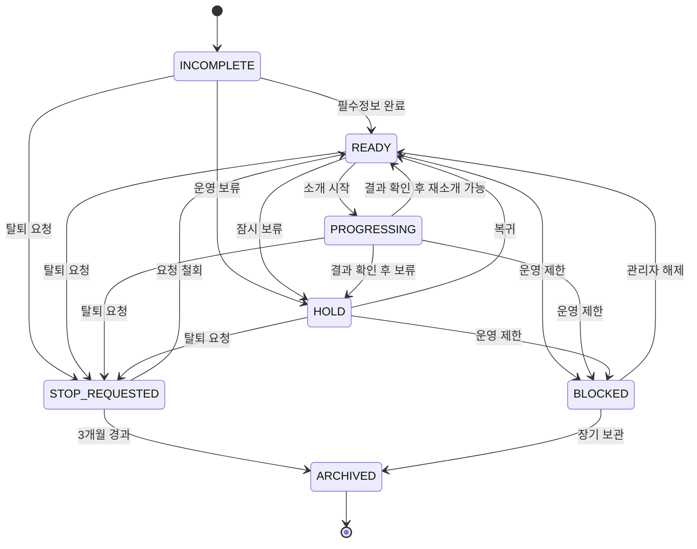
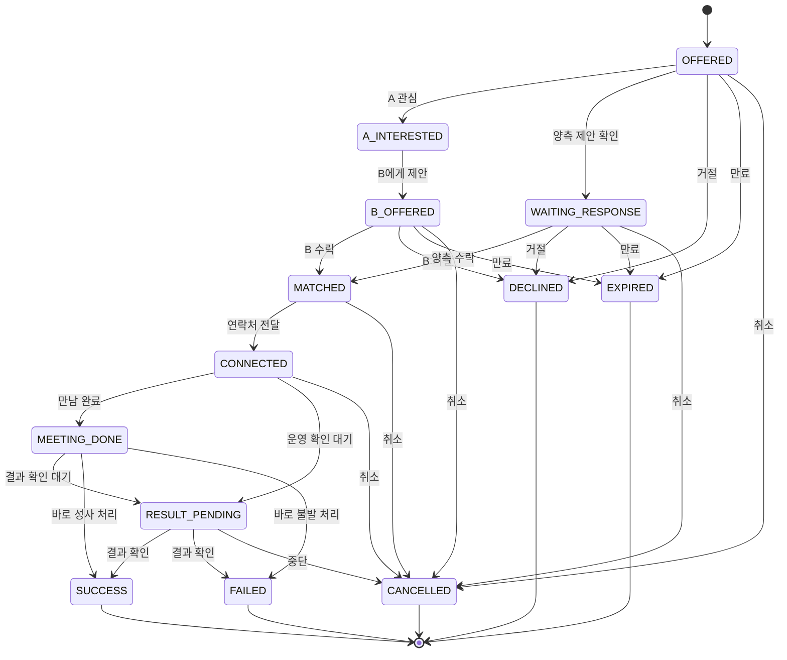

# 도메인 모델 / 상태 정의 / FSM

## 1. 도메인 경계

### 1.1 User
플랫폼 내의 사람 단위 엔티티.  
소개 대상자, 주선자, 운영자 모두 User를 기반으로 한다.

### 1.2 Role
User가 수행할 수 있는 역할.
- `PARTICIPANT`
- `INVITOR`
- `ADMIN`

### 1.3 IntroCase
소개 한 건의 생명주기 단위.

### 1.4 Photo
User가 업로드한 이미지 파일 메타데이터.

### 1.5 Preference
이상형 구조화 정보.

---

## 2. 사용자 상태 정의

### `INCOMPLETE`
필수 프로필이 부족하여 소개 풀에 정상적으로 참여할 수 없는 상태

### `READY`
새로운 소개 제안 가능

### `PROGRESSING`
현재 소개 진행 중이라 다른 소개 제안 불가

### `HOLD`
본인 요청 또는 운영 사유로 잠시 소개 보류

### `STOP_REQUESTED`
소개 풀 탈퇴 요청 상태. 일정 기간 후 보관 처리 예정

### `ARCHIVED`
실운영 소개 풀에서 분리 보관된 상태

### `BLOCKED`
운영 정책상 제한된 상태

---

## 3. 소개 건 상태 정의

### `OFFERED`
양측 또는 대상자에게 소개 제안이 전달된 상태

### `WAITING_RESPONSE`
응답 대기 상태

### `MATCHED`
양쪽 모두 수락 완료

### `CONNECTED`
연락처 또는 연락 채널 연결 완료

### `MEETING_DONE`
실제 만남이 종료된 상태

### `RESULT_PENDING`
운영자가 1:1 결과 확인을 기다리는 상태

### `SUCCESS`
최종 성사 또는 긍정 종료

### `FAILED`
최종 불발

### `DECLINED`
제안 단계에서 거절

### `EXPIRED`
응답 기한 만료

### `CANCELLED`
운영/당사자 사유로 취소

---

## 4. 핵심 운영 규칙

### 규칙 1. 활성 소개 건이 있으면 User는 `PROGRESSING`
활성 상태는 다음과 같다.
- `OFFERED`
- `A_INTERESTED`
- `B_OFFERED`
- `WAITING_RESPONSE`
- `MATCHED`
- `CONNECTED`
- `MEETING_DONE`
- `RESULT_PENDING`

### 규칙 2. 결과 확인 후에만 다음 소개 가능
소개가 끝났다고 바로 `READY`가 되는 것이 아니라,  
운영자가 결과를 확인하고 다음 상태를 결정해야 한다.
- 재소개 가능: `READY`
- 당분간 쉬기 원함: `HOLD`
- 탈퇴 요청: `STOP_REQUESTED`

### 규칙 3. 한 사용자당 동시에 하나의 활성 소개만 허용
같은 사용자가 둘 이상의 활성 `IntroCase`에 동시에 참여하면 안 된다.

### 규칙 4. 주선자는 상태가 아니라 역할이다
한 사용자는 동시에 소개 대상자이면서 주선자일 수 있다.

---

## 5. User FSM

---

## 6. IntroCase FSM

---

## 7. Round / Selection 운영 규칙

### Round
- `DRAFT`: 운영자가 라운드 준비
- `OPEN`: 사용자 선택 가능
- `CLOSED`: 선택 마감
- `MATCHING`: 운영자 조율
- `COMPLETED`: 결과 전달 완료

### Selection
- `READY` + `FULL_OPEN` 사용자만 라운드 선택을 제출할 수 있다.
- `PROGRESSING` 사용자는 후보 노출에서 제외한다.
- 한 사용자당 한 라운드에서 최대 2명까지 선택할 수 있다.
- 선택은 변경할 수 없다. 수정이 필요하면 운영자가 별도 조치한다.
- 상호 선택은 자동 매칭 후보, 단방향 선택은 운영자 판단 대상으로 분류한다.

---

## 8. 파생 상태 계산

### User.status = `PROGRESSING`
조건:
- 사용자가 참여한 `IntroCase` 중 활성 상태가 하나 이상 존재

### User.status = `READY`
조건:
- 필수 프로필 완성
- 차단/보류/탈퇴 요청 상태 아님
- 활성 소개 건 없음

---

## 9. 운영 화면용 라벨

| 코드 | 운영 화면 라벨 |
|---|---|
| INCOMPLETE | 정보 미완성 |
| READY | 소개 가능 |
| PROGRESSING | 소개 진행 중 |
| HOLD | 잠시 보류 |
| STOP_REQUESTED | 탈퇴 요청 |
| ARCHIVED | 보관 완료 |
| BLOCKED | 운영 제한 |
