# ERD 및 데이터 스키마

## 1. 설계 원칙
- User와 IntroCase를 분리한다.
- User의 요약 상태와 IntroCase의 상세 상태를 함께 유지한다.
- 사진 파일은 DB에 직접 넣지 않고 파일 메타데이터만 저장한다.
- 주선자(INVITOR)는 Role로 관리한다.
- 소개 이력 및 상태 변경 이력은 별도 로그 테이블로 추적한다.

---

## 2. ERD

```mermaid
erDiagram
    USERS {
        BIGINT id PK
        VARCHAR name
        VARCHAR gender
        VARCHAR status
        VARCHAR open_level
        BIGINT invited_by_user_id FK
        DATE birth_date
        VARCHAR age_text
        VARCHAR phone
        BOOLEAN contact_visible
        BOOLEAN exposure_consent
        BOOLEAN new_member_notifications_enabled
        BOOLEAN exposure_paused
        TIMESTAMP exposure_paused_at
        INT height_cm
        VARCHAR job_title
        VARCHAR company_name
        TEXT self_intro
        TEXT ideal_type_description
        BIGINT main_photo_id FK
        TIMESTAMP created_at
        TIMESTAMP updated_at
        TIMESTAMP stop_requested_at
        TIMESTAMP archived_at
        TIMESTAMP blocked_at
        VARCHAR blocked_reason
    }

    USER_ROLES {
        BIGINT id PK
        BIGINT user_id FK
        VARCHAR role
        TIMESTAMP created_at
    }

    USER_PREFERENCES {
        BIGINT id PK
        BIGINT user_id FK
        VARCHAR preferred_gender
        INT preferred_age_min
        INT preferred_age_max
        INT preferred_height_min
        INT preferred_height_max
        VARCHAR preferred_job_text
        TEXT preferred_style_text
        TIMESTAMP created_at
        TIMESTAMP updated_at
    }

    USER_PHOTOS {
        BIGINT id PK
        BIGINT user_id FK
        VARCHAR photo_type
        VARCHAR original_file_name
        VARCHAR stored_file_name
        VARCHAR file_path
        VARCHAR file_url
        VARCHAR mime_type
        BIGINT file_size_bytes
        INT width_px
        INT height_px
        INT sort_order
        BOOLEAN is_main
        TIMESTAMP uploaded_at
        TIMESTAMP deleted_at
    }

    INTRO_CASES {
        BIGINT id PK
        VARCHAR status
        BIGINT invitor_user_id FK
        TIMESTAMP created_at
        TIMESTAMP updated_at
        TIMESTAMP offered_at
        TIMESTAMP matched_at
        TIMESTAMP connected_at
        TIMESTAMP meeting_done_at
        TIMESTAMP result_confirmed_at
        TIMESTAMP closed_at
        TEXT memo
    }

    INTRO_CASE_PARTICIPANTS {
        BIGINT id PK
        BIGINT intro_case_id FK
        BIGINT user_id FK
        VARCHAR participant_role
        VARCHAR response_status
        TIMESTAMP responded_at
        TIMESTAMP created_at
        TIMESTAMP updated_at
    }

    INTRO_CASE_EVENTS {
        BIGINT id PK
        BIGINT intro_case_id FK
        VARCHAR from_status
        VARCHAR to_status
        BIGINT actor_user_id FK
        VARCHAR event_type
        TEXT memo
        TIMESTAMP created_at
    }

    INTERESTS {
        BIGINT id PK
        BIGINT from_user_id FK
        BIGINT to_user_id FK
        VARCHAR source
        VARCHAR status
        TIMESTAMP created_at
        TIMESTAMP updated_at
        TIMESTAMP expires_at
    }

    INTRO_CANDIDATES {
        BIGINT id PK
        BIGINT user_a_id FK
        BIGINT user_b_id FK
        TEXT reason
        VARCHAR source
        VARCHAR status
        TIMESTAMP created_at
        TIMESTAMP updated_at
        TIMESTAMP approved_at
        TIMESTAMP rejected_at
        TIMESTAMP converted_at
    }

    NOTIFICATIONS {
        BIGINT id PK
        BIGINT user_id FK
        BIGINT subject_user_id FK
        VARCHAR type
        VARCHAR title
        TEXT body
        VARCHAR link_path
        TIMESTAMP created_at
        TIMESTAMP read_at
    }

    ROUNDS {
        BIGINT id PK
        VARCHAR title
        VARCHAR status
        TIMESTAMP start_at
        TIMESTAMP end_at
        INT selection_limit
        TIMESTAMP created_at
        TIMESTAMP updated_at
    }

    ROUND_SELECTIONS {
        BIGINT id PK
        BIGINT round_id FK
        BIGINT from_user_id FK
        BIGINT to_user_id FK
        TIMESTAMP created_at
    }

    ROUND_PASSES {
        BIGINT id PK
        BIGINT round_id FK
        BIGINT user_id FK
        TEXT reason
        TIMESTAMP created_at
    }

    ENTRY_QUEUE {
        BIGINT id PK
        BIGINT user_id FK
        VARCHAR status
        TIMESTAMP joined_at
        TIMESTAMP ready_at
        TIMESTAMP promoted_at
        TEXT memo
    }

    USER_STATE_HISTORY {
        BIGINT id PK
        BIGINT user_id FK
        VARCHAR from_status
        VARCHAR to_status
        BIGINT actor_user_id FK
        VARCHAR reason_code
        TEXT memo
        TIMESTAMP created_at
    }

    READ_ONLY_BROWSE_TOKENS {
        BIGINT id PK
        BIGINT user_id FK
        VARCHAR label
        VARCHAR token_hash
        VARCHAR token_hint
        TIMESTAMP expires_at
        TIMESTAMP last_used_at
        TIMESTAMP revoked_at
        TIMESTAMP created_at
    }

    USERS ||--o{ USER_ROLES : has
    USERS ||--|| USER_PREFERENCES : has
    USERS ||--o{ USER_PHOTOS : owns
    USERS ||--o{ INTRO_CASE_PARTICIPANTS : joins
    USERS ||--o{ INTRO_CASES : invites
    USERS ||--o{ INTRO_CASE_EVENTS : acts
    USERS ||--o{ INTERESTS : sends
    USERS ||--o{ INTERESTS : receives
    USERS ||--o{ INTRO_CANDIDATES : pairs
    USERS ||--o{ NOTIFICATIONS : receives
    USERS ||--o{ NOTIFICATIONS : subjects
    USERS ||--o{ USER_STATE_HISTORY : changes
    USERS ||--o{ USERS : invites
    USERS ||--o{ ROUND_SELECTIONS : selects
    USERS ||--o{ ROUND_SELECTIONS : selected_by
    USERS ||--o{ ROUND_PASSES : passes
    USERS ||--o{ ENTRY_QUEUE : queues
    USERS ||--o{ READ_ONLY_BROWSE_TOKENS : issues_for
    INTRO_CASES ||--o{ INTRO_CASE_PARTICIPANTS : contains
    INTRO_CASES ||--o{ INTRO_CASE_EVENTS : logs
    ROUNDS ||--o{ ROUND_SELECTIONS : contains
    ROUNDS ||--o{ ROUND_PASSES : contains
```



`USER_PHOTOS.file_path`와 `USER_PHOTOS.file_url`은 Supabase Storage 참조(`supabase-storage:{bucket}/{path}`) 또는 임시 source URL 메모로 사용한다. 최종 사용자 노출은 `/api/photos/{photoId}` 서버 프록시를 통해 수행한다.

---

## 3. 핵심 테이블 설명

### 3.1 USERS
플랫폼의 기본 인물 정보.

주요 컬럼:
- `name`
- `gender`
- `status`
- `open_level`
- `invited_by_user_id`
- `birth_date`
- `age_text` (Notion `나이` 원문처럼 생년/나이 값이 자유 입력일 때 보존)
- `phone`
- `height_cm`
- `job_title`
- `company_name`
- `self_intro`
- `ideal_type_description`
- `main_photo_id`

### 3.2 USER_ROLES
한 유저가 여러 역할을 가질 수 있도록 설계.
- `PARTICIPANT`
- `INVITOR`
- `ADMIN`

### 3.3 USER_PREFERENCES
구조화된 이상형 정보 저장.

### 3.4 USER_PHOTOS
프로필 사진 메타데이터 저장.
- 대표 사진은 `is_main = true`
- 실제 파일은 서버 디스크에 존재

### 3.5 INTRO_CASES
소개 한 건의 마스터 테이블.
- 주선자
- 진행상태
- 주요 상태 시각
- 운영 메모

### 3.6 INTRO_CASE_PARTICIPANTS
소개 건에 참여한 양 당사자 정보.

### 3.7 INTRO_CASE_EVENTS
소개 건의 상태 변경 이력.

### 3.8 USER_STATE_HISTORY
사용자 상태 변경 감사 로그.

### 3.9 READ_ONLY_BROWSE_TOKENS
사용자별 읽기 전용 열람 권한 토큰 저장.
- 토큰 원문은 저장하지 않고 `token_hash` 만 저장
- `token_hint` 로 운영자가 토큰을 식별
- `expires_at`, `revoked_at` 으로 만료/해제 관리
- `last_used_at` 으로 최근 사용 시각 추적

### 3.10 ROUNDS
주 2회 운영할 수 있는 선택 라운드.
- `DRAFT`
- `OPEN`
- `CLOSED`
- `MATCHING`
- `COMPLETED`

### 3.11 ROUND_SELECTIONS
라운드 내 사용자 선택 기록.
- `from_user_id`: 선택한 사용자
- `to_user_id`: 선택된 후보
- 한 라운드에서 같은 후보 중복 선택 금지
- 사용자당 선택 수는 최대 2명

### 3.12 ROUND_PASSES
라운드에서 선택하지 않겠다는 의사 기록.
- `user_id`: 이번 라운드를 패스한 사용자
- `reason`: 선택 안 함 메모
- 한 사용자당 한 라운드 1건만 허용
- 이미 선택을 제출한 사용자는 패스를 남길 수 없음

### 3.13 ENTRY_QUEUE
신규 온보딩 사용자를 자동 노출 준비 상태로 반영하는 큐.
- `WAITING`
- `READY`
- `PROMOTED`
- `CANCELLED`

### 3.14 INTERESTS
자동 노출 풀에서 사용자가 남긴 관심 표시 기록.
- `from_user_id`: 관심을 보낸 사용자
- `to_user_id`: 관심을 받은 사용자
- `source`: 신규 가입자 브라우징 / 기존 회원 알림 / 운영자 수동 생성
- `status`: 활성 / 철회 / 만료 / 소개 전환

### 3.15 INTRO_CANDIDATES
상호 관심이 생겨 운영자 검토가 필요한 소개 후보.
- `user_a_id`, `user_b_id`: 정렬된 페어
- `reason`: 후보 생성 근거
- `status`: 검토 대기 / 승인 / 반려 / 소개 전환 완료

### 3.16 NOTIFICATIONS
자동 노출 풀에서 쓰는 in-app 알림.
- `user_id`: 알림을 받는 사용자
- `subject_user_id`: 알림 대상이 된 신규 멤버
- `type`: 현재는 `NEW_ELIGIBLE_MEMBER`

---

## 4. 추천 DDL 예시

```sql
create table users (
    id bigint primary key auto_increment,
    name varchar(50) not null,
    gender varchar(20) not null,
    status varchar(30) not null,
    birth_date date null,
    age_text varchar(30) null,
    phone varchar(30) null,
    contact_visible boolean not null default false,
    height_cm int null,
    job_title varchar(100) null,
    company_name varchar(100) null,
    self_intro text null,
    ideal_type_description text null,
    main_photo_id bigint null,
    created_at timestamp not null default current_timestamp,
    updated_at timestamp not null default current_timestamp,
    stop_requested_at timestamp null,
    archived_at timestamp null,
    blocked_at timestamp null,
    blocked_reason varchar(255) null
);
```

```sql
create table user_roles (
    id bigint primary key auto_increment,
    user_id bigint not null,
    role varchar(30) not null,
    created_at timestamp not null default current_timestamp,
    unique (user_id, role),
    foreign key (user_id) references users(id)
);
```

```sql
create table user_preferences (
    id bigint primary key auto_increment,
    user_id bigint not null unique,
    preferred_gender varchar(20) null,
    preferred_age_min int null,
    preferred_age_max int null,
    preferred_height_min int null,
    preferred_height_max int null,
    preferred_job_text varchar(255) null,
    preferred_style_text text null,
    created_at timestamp not null default current_timestamp,
    updated_at timestamp not null default current_timestamp,
    foreign key (user_id) references users(id)
);
```

```sql
create table user_photos (
    id bigint primary key auto_increment,
    user_id bigint not null,
    photo_type varchar(30) not null,
    original_file_name varchar(255) not null,
    stored_file_name varchar(255) not null,
    file_path varchar(500) not null,
    file_url varchar(500) null,
    mime_type varchar(100) not null,
    file_size_bytes bigint not null,
    width_px int null,
    height_px int null,
    sort_order int not null default 0,
    is_main boolean not null default false,
    uploaded_at timestamp not null default current_timestamp,
    deleted_at timestamp null,
    foreign key (user_id) references users(id)
);
```

```sql
create table intro_cases (
    id bigint primary key auto_increment,
    status varchar(30) not null,
    invitor_user_id bigint null,
    created_at timestamp not null default current_timestamp,
    updated_at timestamp not null default current_timestamp,
    offered_at timestamp null,
    matched_at timestamp null,
    connected_at timestamp null,
    meeting_done_at timestamp null,
    result_confirmed_at timestamp null,
    closed_at timestamp null,
    memo text null,
    foreign key (invitor_user_id) references users(id)
);
```

```sql
create table intro_case_participants (
    id bigint primary key auto_increment,
    intro_case_id bigint not null,
    user_id bigint not null,
    participant_role varchar(20) not null,
    response_status varchar(20) null,
    responded_at timestamp null,
    created_at timestamp not null default current_timestamp,
    updated_at timestamp not null default current_timestamp,
    unique (intro_case_id, user_id),
    foreign key (intro_case_id) references intro_cases(id),
    foreign key (user_id) references users(id)
);
```

---

## 5. 중요한 제약조건

### 5.1 한 유저당 대표 사진은 최대 1개
- `is_main = true` 는 유저별 1개만 허용
- 애플리케이션 레벨 또는 partial unique index로 강제

### 5.2 한 소개 건은 기본 2명의 참여자를 가진다
- `INTRO_CASE_PARTICIPANTS` 는 기본적으로 2건 존재해야 한다

### 5.3 활성 소개 건 중복 금지
활성 상태의 소개 건에 이미 참여 중인 사용자는 새로운 소개 건에 들어갈 수 없다.

### 5.4 `main_photo_id` 는 해당 유저의 사진만 참조해야 한다
외래키만으로 부족할 수 있어 애플리케이션 검증도 필요하다.
